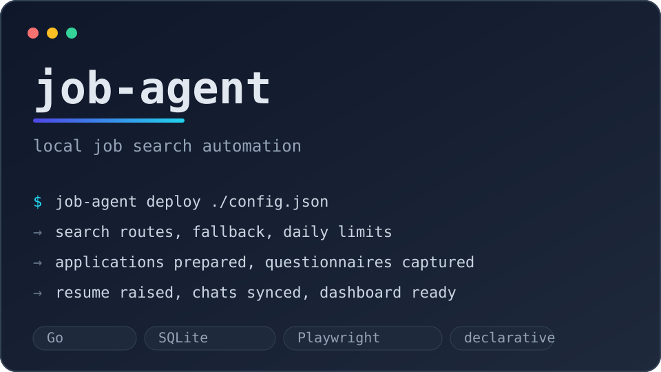

  

> *Фул раскурка по базе*

Начинал с C# и Unity — делал игры. Потом перешёл в backend: Go и C#.
Люблю декларативные конфиги, идемпотентность и автоматизацию.
Linux, Neovim. Сейчас делаю job-agent.

<table align="center">
  <tr>
    <td align="center" width="96"> Go</td>
    <td align="center" width="96"> C#</td>
    <td align="center" width="96"> Python</td>
    <td align="center" width="96"> PostgreSQL</td>
    <td align="center" width="96"> Kafka</td>
    <td align="center" width="96"> Docker</td>
    <td align="center" width="96"> Linux</td>
    <td align="center" width="96"> Neovim</td>
  </tr>
</table>

---

<table>
<tr>
<td width="42%">

</td>
<td width="58%">
<strong><a href="https://github.com/Darkon13/job-agent">job-agent</a></strong> — локальный сервис автоматизации поиска работы: поиск вакансий, отклики, анкеты, чаты и dashboard. Декларативный конфиг вместо кликов, durable-задачи и browser-автоматизация там, где нет API.
  
<code>Go</code> <code>SQLite</code> <code>Playwright</code>
  

</td>
</tr>
</table>

   
  

